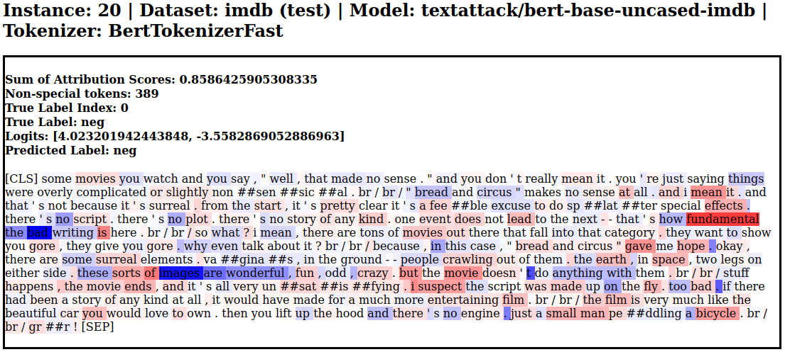

# Thermostat 🌡️

### **Thermostat** combines explainability methods from the `captum` library with Hugging Face's `datasets` and `transformers`.

Explainability in NLP is becoming more important by the day and is getting explored on many different levels. To alleviate computational burden on the hardware that is induced by repetitive execution, **Thermostat** combines popular text classification datasets and state-of-the-art language models with explainability methods commonly applied to NLP tasks.


## Usage

Thermostat datasets always consist of three basic coordinates: Dataset, Model, Explainer.

Clone this repo and then from its root directory, you can use it like this:

```python
import thermostat

# This will use the dataset script ("thermostat.py") in the "thermostat" directory
data = thermostat.load("imdb-bert-lgxa")
# data contains IMDb-BERT-LayerGradientXActivation attributions
```

The configuration always follows this schema: `<dataset>-<model>-<explainer>`.

`data` then contains a subset with the following columns/features:
* `attributions` (the attributions for each token for each data point; type: List of floats)
* `input_ids` (the token IDs of the original dataset; type: List of ints)
* `label` (the label of the original dataset; type: int)
* `predictions` (the class logits of the classifier/downstream model; type: List of floats)  


Additionally,
```python
print(data)
```
...defaults to the string in `data.description` which provides the actual names of the dataset, the explainer and the model
```
IMDb dataset, BERT model, Layer Gradient x Activation explanations
Explainer: LayerGradientXActivation
Model: textattack/bert-base-uncased-imdb
Dataset: imdb
```


### Visualizing attributions as a heatmap

```python
import thermostat
unit = thermostat.load("imdb-bert-lgxa")[20]
unit.render()
```

Refactoring done. More info to be added soon. Please refer to the demo.ipynb Notebook.

Meanwhile, here's the now deprecated HTML visualization:




### Get simple tuple-based heatmap

```python
import thermostat
unit = thermostat.load("imdb-bert-lgxa")[20]
print(unit.explanation)
```

Refactoring done. More info to be added soon. Please refer to the demo.ipynb Notebook.


---

## Explainers
Name | captum | Settings
--- | --- | ---
Layer Gradient x Activation (`lgxa`) | [`.attr.LayerGradientXActivation`](https://captum.ai/api/layer.html#layer-gradient-x-activation) |
Layer Integrated Gradients (`lig`) | [`.attr.LayerIntegratedGradients`](https://captum.ai/api/layer.html#layer-integrated-gradients) | # samples = 25
LIME (`lime`) | [`.attr.LimeBase`](https://captum.ai/api/lime.html) | # samples = 25, <br>mask prob = 0.3
Occlusion (`occ`) | [`.attr.Occlusion`](https://captum.ai/api/occlusion.html) | sliding window = 3
Shapley Value Sampling (`svs`) | [`.attr.ShapleyValueSampling`](https://captum.ai/api/shapley_value_sampling.html) | # samples = 25


## Datasets + Models

✅ = Dataset is downloadable  
⏏️ = Dataset is finished, but not uploaded yet  
🔄 = Currently running on cluster (x n = number of jobs/screens)  
⚠️ = Issue  

### IMDb

[`imdb`](https://huggingface.co/datasets/viewer/?dataset=imdb) is a sentiment analysis dataset with 2 classes (`pos` and `neg`). The available split is the `test` subset containing 25k examples.  
Example configuration: `imdb-xlnet-lig`

Name | 🤗 | `lgxa` | `lig` | `lime` | `occ` | `svs`  
--- | --- | --- | --- | --- | --- | ---
ALBERT (`albert`) | [`textattack/albert-base-v2-imdb`](https://huggingface.co/textattack/albert-base-v2-imdb) | ✅ | ✅ | ✅ | ✅ | ⏏️
BERT (`bert`) | [`textattack/bert-base-uncased-imdb`](https://huggingface.co/textattack/bert-base-uncased-imdb) | ✅ | ✅ | ✅ | ✅ | 🔄x7/7
ELECTRA (`electra`) | [`monologg/electra-small-finetuned-imdb`](https://huggingface.co/monologg/electra-small-finetuned-imdb) | ✅ | ✅ | ✅ | ✅ | 🔄x7/7
RoBERTa (`roberta`) | [`textattack/roberta-base-imdb`](https://huggingface.co/textattack/roberta-base-imdb) | ✅ | ✅ | ✅ | ✅ | ✅
XLNet (`xlnet`) | [`textattack/xlnet-base-cased-imdb`](https://huggingface.co/textattack/xlnet-base-cased-imdb) | ✅ | ✅ | ✅ | ✅ | 🔄x5/5


### MultiNLI

[`multi_nli`](https://huggingface.co/datasets/viewer/?dataset=multi_nli) is a textual entailment dataset. The available split is the `validation_matched` subset containing 9815 examples.  
Example configuration: `multi_nli-roberta-lime`

Name | 🤗 | `lgxa` | `lig` | `lime` | `occ` | `svs`
--- | --- | --- | --- | --- | --- | ---
ALBERT (`albert`) | [`prajjwal1/albert-base-v2-mnli`](https://huggingface.co/prajjwal1/albert-base-v2-mnli) | ✅ | ✅ | ✅ | ✅
BERT (`bert`) | [`textattack/bert-base-uncased-MNLI`](https://huggingface.co/textattack/bert-base-uncased-MNLI) | ✅ | ✅ | ✅ | ✅ | ✅
ELECTRA (`electra`) | [`howey/electra-base-mnli`](https://huggingface.co/howey/electra-base-mnli) | ✅ | ✅ | ✅ | ✅ | 🔄
RoBERTa (`roberta`) | [`textattack/roberta-base-MNLI`](https://huggingface.co/textattack/roberta-base-MNLI) | ✅ | ✅ | ✅ | ✅
XLNet (`xlnet`) | [`textattack/xlnet-base-cased-MNLI`](https://huggingface.co/textattack/xlnet-base-cased-MNLI) | ✅ | ✅ | ✅ | ✅ | 🔄x3/3


### XNLI

[`xnli`](https://huggingface.co/datasets/viewer/?dataset=xnli) is a textual entailment dataset. It provides the test set of MultiNLI through the "en" configuration. The fine-tuned models used here are the same as the MultiNLI ones. The available split is the `test` subset containing 5010 examples.  
Example configuration: `xnli-roberta-lime`

Name | 🤗 | `lgxa` | `lig` | `lime` | `occ` | `svs`
--- | --- | --- | --- | --- | --- | ---
ALBERT (`albert`) | [`prajjwal1/albert-base-v2-mnli`](https://huggingface.co/prajjwal1/albert-base-v2-mnli) | ✅ | ✅ | ✅ | ✅
BERT (`bert`) | [`textattack/bert-base-uncased-MNLI`](https://huggingface.co/textattack/bert-base-uncased-MNLI) | ✅ | ✅ | ✅ | ✅ | ⏏️
ELECTRA (`electra`) | [`howey/electra-base-mnli`](https://huggingface.co/howey/electra-base-mnli) | ✅ | ✅ | ✅ | ✅ | ✅
RoBERTa (`roberta`) | [`textattack/roberta-base-MNLI`](https://huggingface.co/textattack/roberta-base-MNLI) | ✅ | ✅ | ✅ | ✅
XLNet (`xlnet`) | [`textattack/xlnet-base-cased-MNLI`](https://huggingface.co/textattack/xlnet-base-cased-MNLI) | ✅ | ✅ | ✅ | ✅ | 🔄


### AG News

[`ag_news`](https://huggingface.co/datasets/viewer/?dataset=ag_news) is a news topic classification dataset. The available split is the `test` subset containing 7600 examples.  
Example configuration: `ag_news-albert-svs`

Name | 🤗 | `lgxa` | `lig` | `lime` | `occ` | `svs`
--- | --- | --- | --- | --- | --- | ---
ALBERT (`albert`) | [`textattack/albert-base-v2-ag-news`](https://huggingface.co/textattack/albert-base-v2-ag-news) | ✅ | ✅ | ✅ | ✅ | ✅
BERT (`bert`) | [`textattack/bert-base-uncased-ag-news`](https://huggingface.co/textattack/bert-base-uncased-ag-news) | ✅ | ✅ | ✅ | ✅ | ⏏️
RoBERTa (`roberta`) | [`textattack/roberta-base-ag-news`](https://huggingface.co/textattack/roberta-base-ag-news) | ✅ | ✅ | ✅ | ✅ | ⏏️
