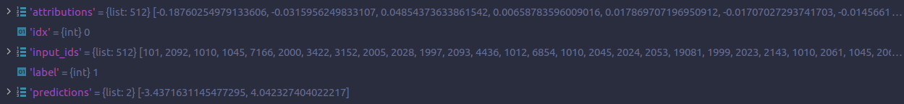
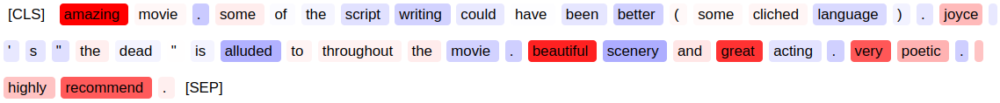
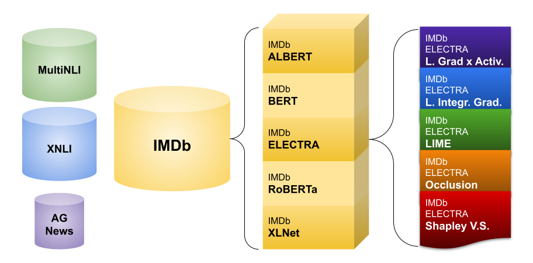

### **Thermostat** is a large collection of NLP model explanations and accompanying analysis tools.

* Combines explainability methods from the `captum` library with Hugging Face's `datasets` and `transformers`.
* Mitigates repetitive execution of common experiments in Explainable NLP and thus reduces the environmental impact and financial roadblocks.
* Increases comparability and replicability of research.
* Reduces the implementational burden.

This work is described in our paper accepted to **EMNLP 2021 System Demonstrations** :  
**Nils Feldhus, Robert Schwarzenberg, and Sebastian Möller.**  
__Thermostat: A Large Collection of NLP Model Explanations and Analysis Tools.__  *2021.*

arXiv pre-print available here: https://arxiv.org/abs/2108.13961  


## Installation

### With pip

[](https://pypi.org/project/thermostat-datasets/)

```bash
pip install thermostat-datasets
```
### Explore on Hugging Face Spaces

The **Spaces** edition of Thermostat launched on October 26, 2021. Check it out here:
[](https://huggingface.co/spaces/nfel/Thermostat)


## Usage

Downloading a dataset requires just two lines of code:

```python
import thermostat
data = thermostat.load("imdb-bert-lig")
```

Thermostat datasets can be addressed and loaded with an identifier string that contains three basic coordinates: Dataset, Model, and Explainer. In this example, the dataset is IMDb (sentiment analysis of movie reviews), the model is a BERT model fine-tuned on the IMDb data, the explanations are generated using a (Layer) Integrated Gradients explainer.

`data` then contains the following columns/features:
* `attributions` (the attributions for each token for each data point; type: List of floats)
* `idx` (the index of the instance in the dataset)
* `input_ids` (the token IDs of the original dataset; type: List of ints)
* `label` (the label of the original dataset; type: int)
* `predictions` (the class logits of the classifier/downstream model; type: List of floats)  

This is the raw content stored in each of the instances of `data`:




If we print `data`, we get more info such as the actual names of the dataset, the explainer and the model:
```python
print(data)
> IMDb dataset, BERT model, Layer Integrated Gradients explanations
> Explainer: LayerIntegratedGradients
> Model: textattack/bert-base-uncased-imdb
> Dataset: imdb
```

### Indexing an instance
We can simply index the loaded dataset like a list:

```python
import thermostat
instance = thermostat.load("imdb-bert-lig")[429]
```


### Visualizing attributions as a heatmap

We can apply `.render()` to every instance to display a heatmap visualization generated by the [displaCy](https://spacy.io/usage/visualizers) library.

```python
instance.render()  # instance refers to the variable assigned in the last codebox
```




### Get simple tuple-based heatmap

The `explanation` attribute stores a tuple-based heatmap with the token, the attribution, and the token index as elements.

```python
print(instance.explanation)  # instance refers to the variable assigned in the second to last codebox

> [('[CLS]', 0.0, 0),
 ('amazing', 2.3141794204711914, 1),
 ('movie', 0.06655970215797424, 2),
 ('.', -0.47832658886909485, 3),
 ('some', 0.15708176791667938, 4),
 ('of', -0.02931656688451767, 5),
 ('the', -0.08834744244813919, 6),
 ('script', -0.2660972774028778, 7),
 ('writing', -0.4021594822406769, 8),
 ('could', -0.19280624389648438, 9),
 ('have', -0.015477157197892666, 10),
 ('been', -0.21898044645786285, 11),
 ('better', -0.4095713794231415, 12),
 ...]  # abbreviated
```

The `heatmap` attribute displays it as a `pandas` table:

```python
print(instance.heatmap)

> token_index    0         1          2         3          4         5    \
token        [CLS]         i       went       and        saw      this   
attribution      0 -0.117371  0.0849944  0.165192  0.0362542 -0.029687   
text_field    text      text       text      text       text      text   

token_index       6         7         8          9          10         11   \
token           movie      last     night      after      being     coaxed   
attribution  0.533126  0.240222  0.171116 -0.0450005 -0.0103401  0.0166524   
text_field       text      text      text       text       text       text   

token_index        13         14          15         16         17   \
token               to         by           a        few    friends   
attribution  0.0269605 -0.0213463  0.00761083  0.0216749  0.0579834   
text_field        text       text        text       text       text   

# abbreviated
```


### Modifying the load function
`thermostat.load()` is a wrapper around [`datasets.load_dataset()`](https://huggingface.co/docs/datasets/package_reference/loading_methods.html#datasets.load_dataset) and you can use any keyword arguments from `load_dataset()` in `load()`, too (except `path`, `name` and `split` which are reserved), e.g. if you want to use another cache directory, you can use the `cache_dir` argument in `thermostat.load()`.

---

## Explainers
Name | captum implementation | Parameters
--- | --- | ---
Layer Gradient x Activation (`lgxa`) | [`.attr.LayerGradientXActivation`](https://captum.ai/api/layer.html#layer-gradient-x-activation) |
Layer Integrated Gradients (`lig`) | [`.attr.LayerIntegratedGradients`](https://captum.ai/api/layer.html#layer-integrated-gradients) | # samples = 25
LIME (`lime`) | [`.attr.LimeBase`](https://captum.ai/api/lime.html) | # samples = 25, <br>mask prob = 0.3
Occlusion (`occ`) | [`.attr.Occlusion`](https://captum.ai/api/occlusion.html) | sliding window = 3
Shapley Value Sampling (`svs`) | [`.attr.ShapleyValueSampling`](https://captum.ai/api/shapley_value_sampling.html) | # samples = 25
Layer DeepLiftShap (`lds`) | [`.attr.LayerDeepLiftShap`](https://captum.ai/api/layer.html#layer-deepliftshap) |
Layer GradientShap (`lgs`) | [`.attr.LayerGradientShap`](https://captum.ai/api/layer.html#layer-gradientshap) | # samples = 5


## Datasets + Models



✅ = Dataset is downloadable  
⏏️ = Dataset is finished, but not uploaded yet  
🔄 = Currently running on cluster (x n = number of jobs/screens)  
⚠️ = Issue  

### IMDb

[`imdb`](https://huggingface.co/datasets/viewer/?dataset=imdb) is a sentiment analysis dataset with 2 classes (`pos` and `neg`). The available split is the `test` subset containing 25k examples.  
Example configuration: `imdb-xlnet-lig`

Name | 🤗 | `lgxa` | `lig` | `lime` | `occ` | `svs` | `lds` | `lgs` 
--- | --- | --- | --- | --- | --- | --- | --- | ---
ALBERT (`albert`) | [`textattack/albert-base-v2-imdb`](https://huggingface.co/textattack/albert-base-v2-imdb) | ✅ | ✅ | ✅ | ✅ | ✅ | ✅ | ✅
BERT (`bert`) | [`textattack/bert-base-uncased-imdb`](https://huggingface.co/textattack/bert-base-uncased-imdb) | ✅ | ✅ | ✅ | ✅ | ✅ | ✅ | ✅
ELECTRA (`electra`) | [`monologg/electra-small-finetuned-imdb`](https://huggingface.co/monologg/electra-small-finetuned-imdb) | ✅ | ✅ | ✅ | ✅ | ✅ | ✅ | ✅
RoBERTa (`roberta`) | [`textattack/roberta-base-imdb`](https://huggingface.co/textattack/roberta-base-imdb) | ✅ | ✅ | ✅ | ✅ | ✅ | ✅ | ✅
XLNet (`xlnet`) | [`textattack/xlnet-base-cased-imdb`](https://huggingface.co/textattack/xlnet-base-cased-imdb) | ✅ | ✅ | ✅ | ✅ | ✅ | ⚠️ | ⚠️


### MultiNLI

[`multi_nli`](https://huggingface.co/datasets/viewer/?dataset=multi_nli) is a textual entailment dataset. The available split is the `validation_matched` subset containing 9815 examples.  
Example configuration: `multi_nli-roberta-lime`

Name | 🤗 | `lgxa` | `lig` | `lime` | `occ` | `svs` | `lds` | `lgs`
--- | --- | --- | --- | --- | --- | --- | --- | ---
ALBERT (`albert`) | [`prajjwal1/albert-base-v2-mnli`](https://huggingface.co/prajjwal1/albert-base-v2-mnli) | ✅ | ✅ | ✅ | ✅ | ✅ | ✅ | ✅
BERT (`bert`) | [`textattack/bert-base-uncased-MNLI`](https://huggingface.co/textattack/bert-base-uncased-MNLI) | ✅ | ✅ | ✅ | ✅ | ✅ | ✅ | ✅
ELECTRA (`electra`) | [`howey/electra-base-mnli`](https://huggingface.co/howey/electra-base-mnli) | ✅ | ✅ | ✅ | ✅ | ✅ | ✅ | ✅
RoBERTa (`roberta`) | [`textattack/roberta-base-MNLI`](https://huggingface.co/textattack/roberta-base-MNLI) | ✅ | ✅ | ✅ | ✅ | ✅ | ✅ | ✅
XLNet (`xlnet`) | [`textattack/xlnet-base-cased-MNLI`](https://huggingface.co/textattack/xlnet-base-cased-MNLI) | ✅ | ✅ | ✅ | ✅ | ✅ | ⚠️ | ⚠️


### XNLI

[`xnli`](https://huggingface.co/datasets/viewer/?dataset=xnli) is a textual entailment dataset. It provides the test set of MultiNLI through the "en" configuration. The fine-tuned models used here are the same as the MultiNLI ones. The available split is the `test` subset containing 5010 examples.  
Example configuration: `xnli-roberta-lime`

Name | 🤗 | `lgxa` | `lig` | `lime` | `occ` | `svs` | `lds` | `lgs`
--- | --- | --- | --- | --- | --- | --- | --- | ---
ALBERT (`albert`) | [`prajjwal1/albert-base-v2-mnli`](https://huggingface.co/prajjwal1/albert-base-v2-mnli) | ✅ | ✅ | ✅ | ✅ | ✅ | ✅ | ✅
BERT (`bert`) | [`textattack/bert-base-uncased-MNLI`](https://huggingface.co/textattack/bert-base-uncased-MNLI) | ✅ | ✅ | ✅ | ✅ | ✅ | ✅ | ✅
ELECTRA (`electra`) | [`howey/electra-base-mnli`](https://huggingface.co/howey/electra-base-mnli) | ✅ | ✅ | ✅ | ✅ | ✅ | ✅ | ✅
RoBERTa (`roberta`) | [`textattack/roberta-base-MNLI`](https://huggingface.co/textattack/roberta-base-MNLI) | ✅ | ✅ | ✅ | ✅ | ✅ | ✅ | ✅
XLNet (`xlnet`) | [`textattack/xlnet-base-cased-MNLI`](https://huggingface.co/textattack/xlnet-base-cased-MNLI) | ✅ | ✅ | ✅ | ✅ | ✅ | ⚠️ | ⚠️


### AG News

[`ag_news`](https://huggingface.co/datasets/viewer/?dataset=ag_news) is a news topic classification dataset. The available split is the `test` subset containing 7600 examples.  
Example configuration: `ag_news-albert-svs`

Name | 🤗 | `lgxa` | `lig` | `lime` | `occ` | `svs` | `lds` | `lgs`
--- | --- | --- | --- | --- | --- | --- | --- | ---
ALBERT (`albert`) | [`textattack/albert-base-v2-ag-news`](https://huggingface.co/textattack/albert-base-v2-ag-news) | ✅ | ✅ | ✅ | ✅ | ✅ | ✅ | ✅
BERT (`bert`) | [`textattack/bert-base-uncased-ag-news`](https://huggingface.co/textattack/bert-base-uncased-ag-news) | ✅ | ✅ | ✅ | ✅ | ✅ | ✅ | ✅
RoBERTa (`roberta`) | [`textattack/roberta-base-ag-news`](https://huggingface.co/textattack/roberta-base-ag-news) | ✅ | ✅ | ✅ | ✅ | ✅ | ✅ | ✅

---

### Contribute a dataset

New explanation datasets must follow the JSONL format and include the five fields `attributions`, `idx`, `input_ids`, `label` and `predictions` as described above in "Usage".

Please follow the instructions for writing a dataset loading script in the official docs of [datasets](https://huggingface.co/docs/datasets/add_dataset.html).

Provide the additional Thermostat metadata via the list of builder configs ([click here to see the Thermostat implementation of builder configs](https://github.com/nfelnlp/thermostat/blob/c877ccf9155d42ec8a820ba9789cc84b8eb5f076/src/thermostat/data/thermostat_configs.py#L158)).

Necessary fields include...
* `name` : The unique identifier string, e.g. including the three coordinates `<DATASET>-<MODEL>-<EXPLAINER>`
* `dataset` : The full name of the dataset, usually follows the naming convention in `datasets`, e.g. `"imdb"`
* `explainer` : The full name of the explainer, usually follows the naming convention in `captum`, e.g. `"LayerIntegratedGradients"`
* `model` : The full name of the model, usually follows the naming convention in `transformers`, e.g. `"textattack/bert-base-uncased-imdb"`
* `label_column` : The name of the column in the JSONL file that contains the label, usually `"label"`
* `label_classes` : The list of label names or classes, e.g. `["entailment", "neutral", "contradiction"]` for NLI datasets
* `text_column` : Either a string (if there is only one text column) or a list of strings that identify the column in the JSONL file that contains the text(s), e.g. `"text"` (IMDb) or `["premise", "hypothesis"]` (NLI)
* `description` : Should at least state the full names of the three coordinates, can optionally include more info such as hyperparameter choices
* `data_url` : The URL to the data storage, e.g. a Google Drive link

plus `features` which you can copy from the codebox below:
```python
features={"attributions": "attributions",
          "predictions": "predictions",
          "input_ids": "input_ids"}
```


While debugging, you can wrap your data with the `Thermopack` class and see if it correctly parses your data:

```python
import thermostat
from datasets import load_dataset
data = load_dataset('your_dataset')
thermostat.Thermopack(data)
```

If you're successful, follow the official instructions for [sharing a community provided dataset at the HuggingFace hub](https://huggingface.co/docs/datasets/share_dataset.html).

At first, all Thermostat contributions will have to be loaded via the code example above. Please notify us of existing explanation datasets by creating an [Issue](https://github.com/DFKI-NLP/thermostat/issues) with the tag [Contribution](https://github.com/DFKI-NLP/thermostat/labels/contribution) and a maintainer of this repository will add your dataset to the Thermostat configs s.t. it can be accessed by everyone via `thermostat.load()`.

---

## Cite Thermostat

```
@inproceedings{feldhus2021thermostat,
    title={Thermostat: A Large Collection of NLP Model Explanations and Analysis Tools},
    author={Nils Feldhus and Robert Schwarzenberg and Sebastian Möller},
    year={2021},
    editor = {Heike Adel and Shuming Shi},
    booktitle = {Proceedings of the 2021 Conference on Empirical Methods in Natural Language Processing: System Demonstrations},
}
```


## Disclaimer
We give no warranties for the correctness of the heatmaps or any other part of the data. This is evolving work and will be hot-patched continuously.

The Thermostat project follows the [ACL and ACM Code of Ethics](https://www.acm.org/code-of-ethics).


## Acknowledgements

The majority of the codebase, especially regarding the combination of transformers and captum, stems from our other recent project [Empirical Explainers](https://github.com/DFKI-NLP/emp-exp).
