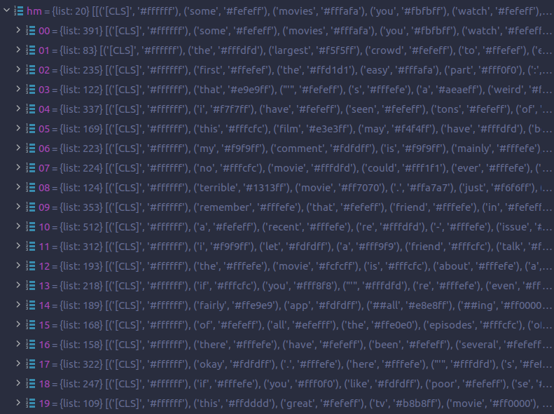

# Thermostat 🌡️

### **Thermostat** combines explainability methods from the `captum` library with Hugging Face's `datasets` and `transformers`.

Explainability in NLP is becoming more important by the day and is getting explored on many different levels. To alleviate computational burden on the hardware that is induced by repetitive execution, **Thermostat** combines popular text classification datasets and state-of-the-art language models with explainability methods commonly applied to NLP tasks.


## Usage

Thermostat datasets always consist of three basic coordinates: Dataset, Model, Explainer.

At the moment, Thermostat is only available via this repository (it will be published to Hugging Face soon).

Clone this repo and then from the root directory, you can use the Thermostat dataset like this:

```python
from datasets import load_dataset

# This will use the dataset script ("thermostat.py") in the "thermostat" directory
data = load_dataset("thermostat", "imdb-bert-lgxa", split="test")
# data contains IMDb-BERT-LayerGradientXActivation attributions
```

The configuration always follows this schema: `<dataset>-<model>-<explainer>`.

`data` then contains a subset with the following columns/features:
* `attributions` (the attributions for each token for each data point; type: List of floats)
* `input_ids` (the token IDs of the original dataset; type: List of ints)
* `label` (the label of the original dataset; type: int)
* `predictions` (the class logits of the classifier/downstream model; type: List of floats)  


Additionally, `data.description` provides the actual names of the dataset, the explainer and the model
```
IMDb dataset, BERT model, Layer Gradient x Activation explanations
Explainer: LayerGradientXActivation
Model: textattack/bert-base-uncased-imdb
Dataset: imdb
```


## Explainers
Name | captum
--- | ---
Layer Gradient x Activation (`lgxa`) | [`.attr.LayerGradientXActivation`](https://captum.ai/api/layer.html#layer-gradient-x-activation)
Layer Integrated Gradients (`lig`) | [`.attr.LayerIntegratedGradients`](https://captum.ai/api/layer.html#layer-integrated-gradients)
Occlusion (`occ`) | [`.attr.Occlusion`](https://captum.ai/api/occlusion.html)
Shapley Value Sampling (`svs`) | [`.attr.ShapleyValueSampling`](https://captum.ai/api/shapley_value_sampling.html)
LIME (`lime`) | [`.attr.LimeBase`](https://captum.ai/api/lime.html)

## Datasets + Models

✅ = Dataset is downloadable  
(✅) = Dataset is finished, but not uploaded yet  
⚠️ = Issue  
🔄 = Currently running on cluster (x n = number of jobs/screens)  
📜 = Config exists  

### IMDb

[`imdb`](https://huggingface.co/datasets/viewer/?dataset=imdb) is a sentiment analysis dataset with 2 classes (`pos` and `neg`). The available split is the `test` subset containing 25k examples.

Name | 🤗 | `lgxa` | `lig` | `lime` | `occ` | `svs`  
--- | --- | --- | --- | --- | --- | ---
ALBERT (`albert`) | [`textattack/albert-base-v2-imdb`](https://huggingface.co/textattack/albert-base-v2-imdb) | ✅ | | ✅ | | 🔄x5
BERT (`bert`) | [`textattack/bert-base-uncased-imdb`](https://huggingface.co/textattack/bert-base-uncased-imdb) | ✅ | ✅ | | ✅
ELECTRA (`electra`) | [`monologg/electra-small-finetuned-imdb`](https://huggingface.co/monologg/electra-small-finetuned-imdb) | ✅ | | |
RoBERTa (`roberta`) | [`textattack/roberta-base-imdb`](https://huggingface.co/textattack/roberta-base-imdb) | ✅ | | | ✅ | 🔄x5
XLNet (`xlnet`) | [`textattack/xlnet-base-cased-imdb`](https://huggingface.co/textattack/xlnet-base-cased-imdb) | ✅ | ✅ | ✅ | |


### MNLI

[`multi_nli`](https://huggingface.co/datasets/viewer/?dataset=multi_nli) is a textual entailment dataset. The available split is the `validation_matched` subset containing 9815 examples.

Name | 🤗 | `lgxa` | `lig` | `lime` | `occ` | `svs`
--- | --- | --- | --- | --- | --- | ---
ALBERT (`albert`) | [`prajjwal1/albert-base-v2-mnli`](https://huggingface.co/prajjwal1/albert-base-v2-mnli) | ✅ | | | ✅
BERT (`bert`) | [`textattack/bert-base-uncased-MNLI`](https://huggingface.co/textattack/bert-base-uncased-MNLI) | ✅ | | ✅ | | 🔄
ELECTRA (`electra`) | [`howey/electra-base-mnli`](https://huggingface.co/howey/electra-base-mnli) | ✅ | ✅ | | | 🔄
RoBERTa (`roberta`) | [`textattack/roberta-base-MNLI`](https://huggingface.co/textattack/roberta-base-MNLI) | ✅ | ✅ | ✅
XLNet (`xlnet`) | [`textattack/xlnet-base-cased-MNLI`](https://huggingface.co/textattack/xlnet-base-cased-MNLI) | ✅ | | ✅ | ✅


### AG News

[`ag_news`](https://huggingface.co/datasets/viewer/?dataset=ag_news) is a news topic classification dataset. The available split is the `test` subset containing 7600 examples.

Name | 🤗 | `lgxa` | `lig` | `lime` | `occ` | `svs`
--- | --- | --- | --- | --- | --- | ---
ALBERT (`albert`) | [`textattack/albert-base-v2-ag-news`](https://huggingface.co/textattack/albert-base-v2-ag-news) | ✅
BERT (`bert`) | [`textattack/bert-base-uncased-ag-news`](https://huggingface.co/textattack/bert-base-uncased-ag-news) | ✅
RoBERTa (`roberta`) | [`textattack/roberta-base-ag-news`](https://huggingface.co/textattack/roberta-base-ag-news) | ✅


---

## Helper functions

### Visualizing attributions as a heatmap
```python
from datasets import load_dataset
from thermostat import to_html

lgxa = load_dataset("thermostat", "imdb-bert-lgxa", split="test")
lgxa_head20 = lgxa.select(range(20))
to_html(lgxa_head20, "imdb-bert-lgxa_heatmaps.html")
```
Runs the visualization script with default settings (`gamma=2.0`, `normalize=True`) on a Thermostat dataset to output an HTML file, returns nothing.  
Note: Always consider file size! Creating an HTML with more than ~100 instances might be difficult to handle for your browser when viewing.  
Recommendation: Using the `select` method on the loaded dataset.

First instance from the [HTML sample](figures/imdb-bert-lgxa_heatmaps_20-40.html) (heading sizes edited for readability):

<html><h3><h5>Instance: 20 | Dataset: imdb (test) | Model: textattack/bert-base-uncased-imdb | Tokenizer: BertTokenizerFast</h5><div style="border:3px solid #000;"><div><h6>Sum of Attribution Scores: 0.8586425905308335 <br/>Non-special tokens: 389 <br/>True Label Index: 0 <br/>True Label: neg <br/>Logits: [4.023201942443848, -3.5582869052886963] <br/>Predicted Label: neg <br/></h4><span style="background-color: rgb(255,255,255)"> [CLS] </span><span style="background-color: rgb(246,246,255)"> some </span><span style="background-color: rgb(255,222,222)"> movies </span><span style="background-color: rgb(224,224,255)"> you </span><span style="background-color: rgb(246,246,255)"> watch </span><span style="background-color: rgb(253,253,255)"> and </span><span style="background-color: rgb(224,224,255)"> you </span><span style="background-color: rgb(244,244,255)"> say </span><span style="background-color: rgb(242,242,255)"> , </span><span style="background-color: rgb(255,251,251)"> " </span><span style="background-color: rgb(234,234,255)"> well </span><span style="background-color: rgb(255,245,245)"> , </span><span style="background-color: rgb(241,241,255)"> that </span><span style="background-color: rgb(232,232,255)"> made </span><span style="background-color: rgb(239,239,255)"> no </span><span style="background-color: rgb(255,254,254)"> sense </span><span style="background-color: rgb(255,253,253)"> . </span><span style="background-color: rgb(255,247,247)"> " </span><span style="background-color: rgb(242,242,255)"> and </span><span style="background-color: rgb(255,245,245)"> you </span><span style="background-color: rgb(255,253,253)"> don </span><span style="background-color: rgb(247,247,255)"> ' </span><span style="background-color: rgb(255,243,243)"> t </span><span style="background-color: rgb(248,248,255)"> really </span><span style="background-color: rgb(255,233,233)"> mean </span><span style="background-color: rgb(249,249,255)"> it </span><span style="background-color: rgb(255,252,252)"> . </span><span style="background-color: rgb(254,254,255)"> you </span><span style="background-color: rgb(231,231,255)"> ' </span><span style="background-color: rgb(255,243,243)"> re </span><span style="background-color: rgb(238,238,255)"> just </span><span style="background-color: rgb(252,252,255)"> saying </span><span style="background-color: rgb(203,203,255)"> things </span><span style="background-color: rgb(255,254,254)"> were </span><span style="background-color: rgb(249,249,255)"> overly </span><span style="background-color: rgb(246,246,255)"> complicated </span><span style="background-color: rgb(255,230,230)"> or </span><span style="background-color: rgb(255,232,232)"> slightly </span><span style="background-color: rgb(251,251,255)"> non </span><span style="background-color: rgb(246,246,255)"> ##sen </span><span style="background-color: rgb(255,251,251)"> ##sic </span><span style="background-color: rgb(250,250,255)"> ##al </span><span style="background-color: rgb(255,247,247)"> . </span><span style="background-color: rgb(244,244,255)">  </span><span style="background-color: rgb(241,241,255)"> br </span><span style="background-color: rgb(253,253,255)"> / </span><span style="background-color: rgb(228,228,255)">  </span><span style="background-color: rgb(235,235,255)">  </span><span style="background-color: rgb(228,228,255)"> br </span><span style="background-color: rgb(245,245,255)"> / </span><span style="background-color: rgb(242,242,255)">  </span><span style="background-color: rgb(224,224,255)"> " </span><span style="background-color: rgb(195,195,255)"> bread </span><span style="background-color: rgb(247,247,255)"> and </span><span style="background-color: rgb(214,214,255)"> circus </span><span style="background-color: rgb(221,221,255)"> " </span><span style="background-color: rgb(255,254,254)"> makes </span><span style="background-color: rgb(235,235,255)"> no </span><span style="background-color: rgb(255,241,241)"> sense </span><span style="background-color: rgb(255,192,192)"> at </span><span style="background-color: rgb(235,235,255)"> all </span><span style="background-color: rgb(230,230,255)"> . </span><span style="background-color: rgb(255,215,215)"> and </span><span style="background-color: rgb(239,239,255)"> i </span><span style="background-color: rgb(255,148,148)"> mean </span><span style="background-color: rgb(255,217,217)"> it </span><span style="background-color: rgb(227,227,255)"> . </span><span style="background-color: rgb(249,249,255)"> and </span><span style="background-color: rgb(240,240,255)"> that </span><span style="background-color: rgb(254,254,255)"> ' </span><span style="background-color: rgb(241,241,255)"> s </span><span style="background-color: rgb(255,254,254)"> not </span><span style="background-color: rgb(245,245,255)"> because </span><span style="background-color: rgb(255,241,241)"> it </span><span style="background-color: rgb(255,239,239)"> ' </span><span style="background-color: rgb(245,245,255)"> s </span><span style="background-color: rgb(255,240,240)"> surreal </span><span style="background-color: rgb(255,212,212)"> . </span><span style="background-color: rgb(255,235,235)"> from </span><span style="background-color: rgb(233,233,255)"> the </span><span style="background-color: rgb(255,227,227)"> start </span><span style="background-color: rgb(241,241,255)"> , </span><span style="background-color: rgb(247,247,255)"> it </span><span style="background-color: rgb(245,245,255)"> ' </span><span style="background-color: rgb(251,251,255)"> s </span><span style="background-color: rgb(255,219,219)"> pretty </span><span style="background-color: rgb(255,251,251)"> clear </span><span style="background-color: rgb(254,254,255)"> it </span><span style="background-color: rgb(243,243,255)"> ' </span><span style="background-color: rgb(230,230,255)"> s </span><span style="background-color: rgb(255,209,209)"> a </span><span style="background-color: rgb(255,212,212)"> fee </span><span style="background-color: rgb(242,242,255)"> ##ble </span><span style="background-color: rgb(224,224,255)"> excuse </span><span style="background-color: rgb(255,233,233)"> to </span><span style="background-color: rgb(255,239,239)"> do </span><span style="background-color: rgb(229,229,255)"> sp </span><span style="background-color: rgb(239,239,255)"> ##lat </span><span style="background-color: rgb(253,253,255)"> ##ter </span><span style="background-color: rgb(255,248,248)"> special </span><span style="background-color: rgb(255,177,177)"> effects </span><span style="background-color: rgb(195,195,255)"> . </span><span style="background-color: rgb(248,248,255)"> there </span><span style="background-color: rgb(234,234,255)"> ' </span><span style="background-color: rgb(219,219,255)"> s </span><span style="background-color: rgb(158,158,255)"> no </span><span style="background-color: rgb(255,228,228)"> script </span><span style="background-color: rgb(245,245,255)"> . </span><span style="background-color: rgb(255,254,254)"> there </span><span style="background-color: rgb(247,247,255)"> ' </span><span style="background-color: rgb(242,242,255)"> s </span><span style="background-color: rgb(173,173,255)"> no </span><span style="background-color: rgb(255,219,219)"> plot </span><span style="background-color: rgb(255,253,253)"> . </span><span style="background-color: rgb(255,241,241)"> there </span><span style="background-color: rgb(255,252,252)"> ' </span><span style="background-color: rgb(221,221,255)"> s </span><span style="background-color: rgb(237,237,255)"> no </span><span style="background-color: rgb(255,241,241)"> story </span><span style="background-color: rgb(255,227,227)"> of </span><span style="background-color: rgb(255,241,241)"> any </span><span style="background-color: rgb(255,208,208)"> kind </span><span style="background-color: rgb(255,246,246)"> . </span><span style="background-color: rgb(255,250,250)"> one </span><span style="background-color: rgb(255,223,223)"> event </span><span style="background-color: rgb(255,210,210)"> does </span><span style="background-color: rgb(252,252,255)"> not </span><span style="background-color: rgb(255,186,186)"> lead </span><span style="background-color: rgb(243,243,255)"> to </span><span style="background-color: rgb(253,253,255)"> the </span><span style="background-color: rgb(236,236,255)"> next </span><span style="background-color: rgb(255,226,226)"> - </span><span style="background-color: rgb(255,248,248)"> - </span><span style="background-color: rgb(237,237,255)"> that </span><span style="background-color: rgb(255,252,252)"> ' </span><span style="background-color: rgb(255,233,233)"> s </span><span style="background-color: rgb(183,183,255)"> how </span><span style="background-color: rgb(255,59,59)"> fundamental </span><span style="background-color: rgb(140,140,255)"> the </span><span style="background-color: rgb(0,0,255)"> bad </span><span style="background-color: rgb(201,201,255)"> writing </span><span style="background-color: rgb(255,129,129)"> is </span><span style="background-color: rgb(249,249,255)"> here </span><span style="background-color: rgb(255,243,243)"> . </span><span style="background-color: rgb(255,244,244)">  </span><span style="background-color: rgb(248,248,255)"> br </span><span style="background-color: rgb(243,243,255)"> / </span><span style="background-color: rgb(255,249,249)">  </span><span style="background-color: rgb(255,239,239)">  </span><span style="background-color: rgb(244,244,255)"> br </span><span style="background-color: rgb(255,227,227)"> / </span><span style="background-color: rgb(226,226,255)">  </span><span style="background-color: rgb(255,241,241)"> so </span><span style="background-color: rgb(220,220,255)"> what </span><span style="background-color: rgb(255,220,220)"> ? </span><span style="background-color: rgb(253,253,255)"> i </span><span style="background-color: rgb(215,215,255)"> mean </span><span style="background-color: rgb(249,249,255)"> , </span><span style="background-color: rgb(255,240,240)"> there </span><span style="background-color: rgb(255,251,251)"> are </span><span style="background-color: rgb(239,239,255)"> tons </span><span style="background-color: rgb(243,243,255)"> of </span><span style="background-color: rgb(255,200,200)"> movies </span><span style="background-color: rgb(255,219,219)"> out </span><span style="background-color: rgb(248,248,255)"> there </span><span style="background-color: rgb(249,249,255)"> that </span><span style="background-color: rgb(255,248,248)"> fall </span><span style="background-color: rgb(236,236,255)"> into </span><span style="background-color: rgb(243,243,255)"> that </span><span style="background-color: rgb(255,241,241)"> category </span><span style="background-color: rgb(255,206,206)"> . </span><span style="background-color: rgb(237,237,255)"> they </span><span style="background-color: rgb(241,241,255)"> want </span><span style="background-color: rgb(220,220,255)"> to </span><span style="background-color: rgb(255,248,248)"> show </span><span style="background-color: rgb(255,249,249)"> you </span><span style="background-color: rgb(255,219,219)"> gore </span><span style="background-color: rgb(248,248,255)"> , </span><span style="background-color: rgb(247,247,255)"> they </span><span style="background-color: rgb(254,254,255)"> give </span><span style="background-color: rgb(236,236,255)"> you </span><span style="background-color: rgb(255,233,233)"> gore </span><span style="background-color: rgb(188,188,255)"> . </span><span style="background-color: rgb(212,212,255)"> why </span><span style="background-color: rgb(225,225,255)"> even </span><span style="background-color: rgb(255,243,243)"> talk </span><span style="background-color: rgb(246,246,255)"> about </span><span style="background-color: rgb(247,247,255)"> it </span><span style="background-color: rgb(255,245,245)"> ? </span><span style="background-color: rgb(255,247,247)">  </span><span style="background-color: rgb(243,243,255)"> br </span><span style="background-color: rgb(249,249,255)"> / </span><span style="background-color: rgb(244,244,255)">  </span><span style="background-color: rgb(255,250,250)">  </span><span style="background-color: rgb(252,252,255)"> br </span><span style="background-color: rgb(255,229,229)"> / </span><span style="background-color: rgb(224,224,255)">  </span><span style="background-color: rgb(237,237,255)"> because </span><span style="background-color: rgb(255,243,243)"> , </span><span style="background-color: rgb(167,167,255)"> in </span><span style="background-color: rgb(228,228,255)"> this </span><span style="background-color: rgb(235,235,255)"> case </span><span style="background-color: rgb(248,248,255)"> , </span><span style="background-color: rgb(248,248,255)"> " </span><span style="background-color: rgb(255,220,220)"> bread </span><span style="background-color: rgb(255,237,237)"> and </span><span style="background-color: rgb(255,236,236)"> circus </span><span style="background-color: rgb(255,228,228)"> " </span><span style="background-color: rgb(255,147,147)"> gave </span><span style="background-color: rgb(239,239,255)"> me </span><span style="background-color: rgb(255,181,181)"> hope </span><span style="background-color: rgb(130,130,255)"> . </span><span style="background-color: rgb(255,235,235)"> okay </span><span style="background-color: rgb(255,242,242)"> , </span><span style="background-color: rgb(254,254,255)"> there </span><span style="background-color: rgb(255,241,241)"> are </span><span style="background-color: rgb(209,209,255)"> some </span><span style="background-color: rgb(255,213,213)"> surreal </span><span style="background-color: rgb(245,245,255)"> elements </span><span style="background-color: rgb(255,227,227)"> . </span><span style="background-color: rgb(250,250,255)"> va </span><span style="background-color: rgb(229,229,255)"> ##gina </span><span style="background-color: rgb(233,233,255)"> ##s </span><span style="background-color: rgb(234,234,255)"> , </span><span style="background-color: rgb(240,240,255)"> in </span><span style="background-color: rgb(252,252,255)"> the </span><span style="background-color: rgb(242,242,255)"> ground </span><span style="background-color: rgb(250,250,255)"> - </span><span style="background-color: rgb(240,240,255)"> - </span><span style="background-color: rgb(219,219,255)"> people </span><span style="background-color: rgb(255,212,212)"> crawling </span><span style="background-color: rgb(255,236,236)"> out </span><span style="background-color: rgb(255,250,250)"> of </span><span style="background-color: rgb(244,244,255)"> them </span><span style="background-color: rgb(255,212,212)"> . </span><span style="background-color: rgb(219,219,255)"> the </span><span style="background-color: rgb(255,191,191)"> earth </span><span style="background-color: rgb(210,210,255)"> , </span><span style="background-color: rgb(255,242,242)"> in </span><span style="background-color: rgb(255,183,183)"> space </span><span style="background-color: rgb(247,247,255)"> , </span><span style="background-color: rgb(242,242,255)"> two </span><span style="background-color: rgb(255,245,245)"> legs </span><span style="background-color: rgb(237,237,255)"> on </span><span style="background-color: rgb(249,249,255)"> either </span><span style="background-color: rgb(232,232,255)"> side </span><span style="background-color: rgb(255,218,218)"> . </span><span style="background-color: rgb(175,175,255)"> these </span><span style="background-color: rgb(255,169,169)"> sorts </span><span style="background-color: rgb(255,120,120)"> of </span><span style="background-color: rgb(21,21,255)"> images </span><span style="background-color: rgb(109,109,255)"> are </span><span style="background-color: rgb(143,143,255)"> wonderful </span><span style="background-color: rgb(191,191,255)"> , </span><span style="background-color: rgb(255,207,207)"> fun </span><span style="background-color: rgb(214,214,255)"> , </span><span style="background-color: rgb(232,232,255)"> odd </span><span style="background-color: rgb(181,181,255)"> , </span><span style="background-color: rgb(255,206,206)"> crazy </span><span style="background-color: rgb(255,240,240)"> . </span><span style="background-color: rgb(255,153,153)"> but </span><span style="background-color: rgb(255,242,242)"> the </span><span style="background-color: rgb(255,146,146)"> movie </span><span style="background-color: rgb(255,227,227)"> doesn </span><span style="background-color: rgb(247,247,255)"> ' </span><span style="background-color: rgb(78,78,255)"> t </span><span style="background-color: rgb(236,236,255)"> do </span><span style="background-color: rgb(188,188,255)"> anything </span><span style="background-color: rgb(186,186,255)"> with </span><span style="background-color: rgb(250,250,255)"> them </span><span style="background-color: rgb(255,208,208)"> . </span><span style="background-color: rgb(255,215,215)">  </span><span style="background-color: rgb(255,251,251)"> br </span><span style="background-color: rgb(255,224,224)"> / </span><span style="background-color: rgb(254,254,255)">  </span><span style="background-color: rgb(253,253,255)">  </span><span style="background-color: rgb(255,231,231)"> br </span><span style="background-color: rgb(232,232,255)"> / </span><span style="background-color: rgb(255,246,246)">  </span><span style="background-color: rgb(234,234,255)"> stuff </span><span style="background-color: rgb(255,234,234)"> happens </span><span style="background-color: rgb(255,199,199)"> , </span><span style="background-color: rgb(255,213,213)"> the </span><span style="background-color: rgb(255,211,211)"> movie </span><span style="background-color: rgb(255,180,180)"> ends </span><span style="background-color: rgb(255,240,240)"> , </span><span style="background-color: rgb(255,214,214)"> and </span><span style="background-color: rgb(243,243,255)"> it </span><span style="background-color: rgb(249,249,255)"> ' </span><span style="background-color: rgb(248,248,255)"> s </span><span style="background-color: rgb(232,232,255)"> all </span><span style="background-color: rgb(255,240,240)"> very </span><span style="background-color: rgb(255,241,241)"> un </span><span style="background-color: rgb(255,213,213)"> ##sat </span><span style="background-color: rgb(255,230,230)"> ##is </span><span style="background-color: rgb(255,228,228)"> ##fying </span><span style="background-color: rgb(255,200,200)"> . </span><span style="background-color: rgb(255,138,138)"> i </span><span style="background-color: rgb(255,160,160)"> suspect </span><span style="background-color: rgb(223,223,255)"> the </span><span style="background-color: rgb(255,253,253)"> script </span><span style="background-color: rgb(255,218,218)"> was </span><span style="background-color: rgb(255,205,205)"> made </span><span style="background-color: rgb(228,228,255)"> up </span><span style="background-color: rgb(166,166,255)"> on </span><span style="background-color: rgb(255,236,236)"> the </span><span style="background-color: rgb(255,183,183)"> fly </span><span style="background-color: rgb(255,226,226)"> . </span><span style="background-color: rgb(190,190,255)"> too </span><span style="background-color: rgb(255,207,207)"> bad </span><span style="background-color: rgb(91,91,255)"> . </span><span style="background-color: rgb(232,232,255)"> if </span><span style="background-color: rgb(253,253,255)"> there </span><span style="background-color: rgb(241,241,255)"> had </span><span style="background-color: rgb(255,238,238)"> been </span><span style="background-color: rgb(249,249,255)"> a </span><span style="background-color: rgb(255,249,249)"> story </span><span style="background-color: rgb(255,237,237)"> of </span><span style="background-color: rgb(255,246,246)"> any </span><span style="background-color: rgb(253,253,255)"> kind </span><span style="background-color: rgb(255,253,253)"> at </span><span style="background-color: rgb(253,253,255)"> all </span><span style="background-color: rgb(255,237,237)"> , </span><span style="background-color: rgb(255,253,253)"> it </span><span style="background-color: rgb(255,245,245)"> would </span><span style="background-color: rgb(255,251,251)"> have </span><span style="background-color: rgb(255,250,250)"> made </span><span style="background-color: rgb(241,241,255)"> for </span><span style="background-color: rgb(255,241,241)"> a </span><span style="background-color: rgb(255,244,244)"> much </span><span style="background-color: rgb(239,239,255)"> more </span><span style="background-color: rgb(255,226,226)"> entertaining </span><span style="background-color: rgb(255,193,193)"> film </span><span style="background-color: rgb(249,249,255)"> . </span><span style="background-color: rgb(255,252,252)">  </span><span style="background-color: rgb(255,247,247)"> br </span><span style="background-color: rgb(255,254,254)"> / </span><span style="background-color: rgb(255,243,243)">  </span><span style="background-color: rgb(255,234,234)">  </span><span style="background-color: rgb(255,248,248)"> br </span><span style="background-color: rgb(255,242,242)"> / </span><span style="background-color: rgb(255,239,239)">  </span><span style="background-color: rgb(255,205,205)"> the </span><span style="background-color: rgb(255,189,189)"> film </span><span style="background-color: rgb(255,220,220)"> is </span><span style="background-color: rgb(255,245,245)"> very </span><span style="background-color: rgb(255,245,245)"> much </span><span style="background-color: rgb(255,244,244)"> like </span><span style="background-color: rgb(255,228,228)"> the </span><span style="background-color: rgb(240,240,255)"> beautiful </span><span style="background-color: rgb(255,237,237)"> car </span><span style="background-color: rgb(255,191,191)"> you </span><span style="background-color: rgb(255,241,241)"> would </span><span style="background-color: rgb(244,244,255)"> love </span><span style="background-color: rgb(255,223,223)"> to </span><span style="background-color: rgb(250,250,255)"> own </span><span style="background-color: rgb(255,254,254)"> . </span><span style="background-color: rgb(255,249,249)"> then </span><span style="background-color: rgb(255,253,253)"> you </span><span style="background-color: rgb(255,246,246)"> lift </span><span style="background-color: rgb(215,215,255)"> up </span><span style="background-color: rgb(255,240,240)"> the </span><span style="background-color: rgb(255,250,250)"> hood </span><span style="background-color: rgb(191,191,255)"> and </span><span style="background-color: rgb(255,225,225)"> there </span><span style="background-color: rgb(217,217,255)"> ' </span><span style="background-color: rgb(232,232,255)"> s </span><span style="background-color: rgb(193,193,255)"> no </span><span style="background-color: rgb(255,235,235)"> engine </span><span style="background-color: rgb(123,123,255)"> . </span><span style="background-color: rgb(255,218,218)"> just </span><span style="background-color: rgb(223,223,255)"> a </span><span style="background-color: rgb(255,181,181)"> small </span><span style="background-color: rgb(255,182,182)"> man </span><span style="background-color: rgb(255,216,216)"> pe </span><span style="background-color: rgb(235,235,255)"> ##ddling </span><span style="background-color: rgb(175,175,255)"> a </span><span style="background-color: rgb(255,158,158)"> bicycle </span><span style="background-color: rgb(255,243,243)"> . </span><span style="background-color: rgb(255,246,246)">  </span><span style="background-color: rgb(248,248,255)"> br </span><span style="background-color: rgb(255,239,239)"> / </span><span style="background-color: rgb(255,238,238)">  </span><span style="background-color: rgb(255,234,234)">  </span><span style="background-color: rgb(255,230,230)"> br </span><span style="background-color: rgb(255,239,239)"> / </span><span style="background-color: rgb(255,241,241)">  </span><span style="background-color: rgb(255,221,221)"> gr </span><span style="background-color: rgb(238,238,255)"> ##r </span><span style="background-color: rgb(255,239,239)"> ! </span><span style="background-color: rgb(255,255,255)"> [SEP] </span></br></br></div></div></br></br></br></html>


### Get coordinate
```python
from thermostat import get_coordinate

get_coordinate(lgxa, "Explainer")

>>> 'LayerGradientXActivation'
```
Takes a Thermostat dataset and a coordinate string (`'Model'`, `'Dataset'` or `'Explainer'`, pay attention to capitalization!) and returns the requested value of the coordinate as string, e.g. `LayerIntegratedGradients` for `Explainer`.


### Get simple tuple-based heatmap
```python
from thermostat import get_heatmap

hm = get_heatmap(lgxa_head20)
```
Returns a list of tuples in the form of <token,color> for each data point of a Thermostat dataset.




### Config files
jsonnet config files have the following naming convention:
`<DATASET_ID>/<EXPLAINER_ID>/<MODEL_ID>.jsonnet` where
* `<DATASET_ID>` corresponds to a dataset (from `datasets` package by default, but can be any other locally stored dataset),
* `<EXPLAINER_ID>` corresponds to an explainability method (usually provided through the `captum` package) and
* `<MODEL_ID>` corresponds to a model (from `transformers` package by default)
