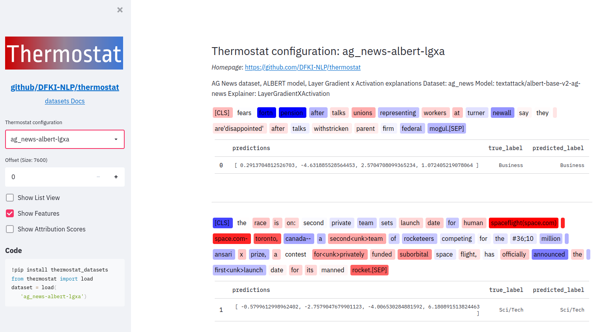

# Exploring Thermostat with Streamlit

This is based on an implementation by [Hugging Face](https://github.com/huggingface/datasets-viewer/tree/master) which they are using for their browser interface called [datasets viewer](https://huggingface.co/datasets/viewer/).

1. Setup a virtual environment and install our [PyPI package](https://pypi.org/project/thermostat-datasets/) `thermostat-datasets`.  
2. Run `streamlit run run.py` from this directory which opens a new tab in your browser.
3. At the start, it will automatically download the `ag_news-albert-lgxa` configuration to your cache directory. This can take a while depending on your connection.
4. You can now freely explore all the Thermostat configurations using the sidebar dropdown menu.

The checkbox "Show Attribution Scores" additionally gives you the option to add the feature attributions (rounded to three digits) as labels to each token.
